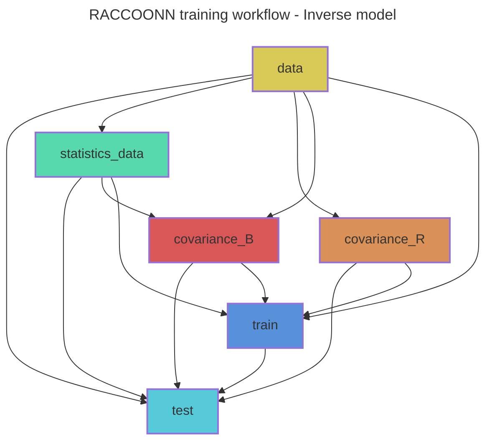

# RACCOONN: Retrieval of Atmospheric Conditions Computed using Observations, Optimization, and Neural Networks. 
RACCOONN uses deep learning to estimate atmospheric thermodynamic profiles from raw radiance observations. 
It can work with or without a prior/background state of the atmosphere. 
The goal is to create an inverse observation operator for assimilating radiances in the form of thermodynamic profiles.
# Installation

Clone the repository:

```bash
git clone https://github.com/tremblaybenoit/RACCOONN.git
```
RACCOONN is built with [PyTorch Lightning](https://lightning.ai/docs/pytorch/stable/) and [Hydra](https://hydra.cc/docs/intro/).

# Usage

## Automated workflow (recommended)
RACCOONN uses the [Snakemake workflow management system](https://snakemake.readthedocs.io/en/stable/) for reproducibility.

To perform a dry-run (i.e., to check the workflow prior to execution) of the `test` rule with the `inverse_operator` experiment configuration:

```bash
snakemake --dry-run --verbose test --config hydra-experiment=inverse_operator
```

Remove `--dry-run` to actually run the workflow. 

To account for missing dependencies, add the `--rerun-incomplete` flag:

```bash
snakemake --dry-run --rerun-incomplete --verbose test --config hydra-experiment=inverse_operator
```

To draw a directed acyclic graph (DAG) of the training workflow (e.g., `test.mmd` of rule `test`):

```bash
snakemake test --rulegraph mermaid-js --config hydra-experiment=pinnverse_operator_000 > dag.mmd
```
Replace `--rulegraph` with `--dag` to highlight completed rules with dashed boxes.

The following graph shows the workflow for the `test` rule with the `inverse_operator` experiment configuration: 


## Manual execution of individual steps
Each step of the workflow can be run manually using the corresponding Python script and 
the desired experiment configuration (e.g., inverse_operator for the inverse model).

1. Data preparation for the inverse model:
```bash
python -m inverse.data.statistics +experiment=inverse_operator
python -m inverse.data.covariance +experiment=inverse_operator
```
2. Train the inverse model:
```bash
python -m inverse.train +experiment=inverse_operator
```
3. Test and evaluate the inverse model:
```bash
python -m inverse.test +experiment=inverse_operator
python -m inverse.evaluation.validation +experiment=inverse_operator
```


# Documentation
The RACCOON project documentation is available at https://raccoonn.readthedocs.io/.

# References and Acknowledgements
- The forward model is a translation from Keras to Pytorch Lightning of an emulator published in the following paper and repository: 
  - Paper by Howard et al. (2025): https://www.arxiv.org/abs/2504.16192.
  - Repository: https://zenodo.org/records/13963758.
- Inspiration for the PyTorch Lightning + Hydra framework comes from the following repositories: 
  - Lightning-Hydra-Template: https://github.com/ashleve/lightning-hydra-template.
  - Anemoi framework by ECMWF: https://github.com/ecmwf/anemoi-core.
- Inspiration for the use of Neural Fields (NFs) for retrievals/inversions comes from the following paper and repository:
  - Paper by Jarolim et al. (2025): https://arxiv.org/pdf/2502.13924.
  - Repository: https://github.com/RobertJaro/pinn-me.
- Inspiration for the use of emulation for retrievals/inversions comes from the following papers:
  - Paper by Girtsou et al. (2024): https://neurips.cc/media/PosterPDFs/NeurIPS%202024/100006.png?t=1733082861.1906157.
