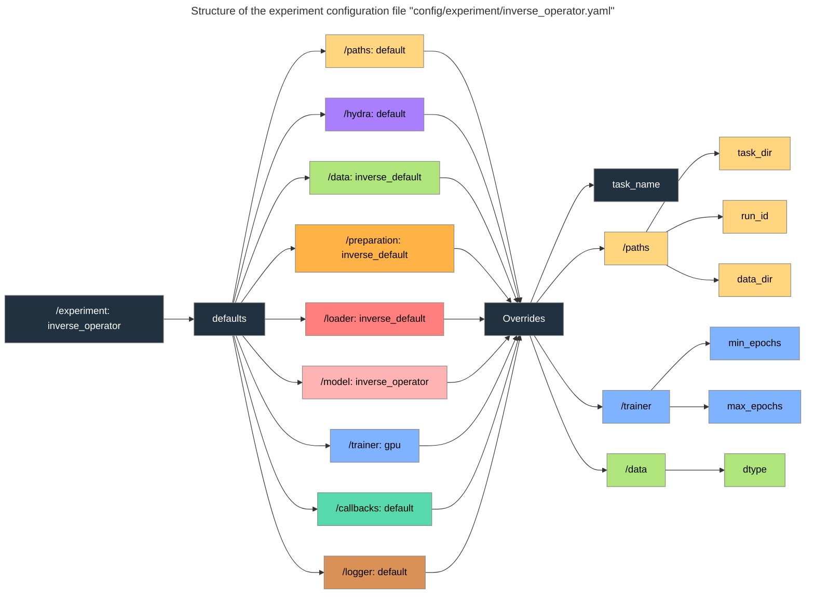
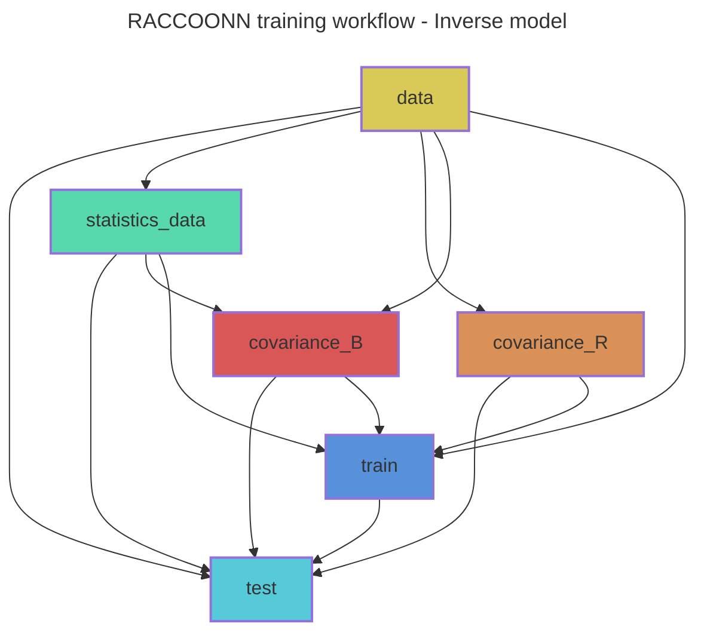

# RACCOONN: Retrieval of Atmospheric Conditions Computed using Observations, Optimization, and Neural Networks. 
RACCOONN uses deep learning to estimate atmospheric thermodynamic profiles from raw radiance observations. 
A prior/background state of the atmosphere can be provided. 
The goal is to create an inverse observation operator for the assimilation of radiances in the form of thermodynamic profiles.

## Table of Contents
- [Installation](#installation)
- [Usage](#usage)
  - [Experiment configuration](#experiment-configuration)
  - [Manual execution of individual steps](#manual-execution-of-individual-steps)
    - [Forward model](#forward-model-eg-experimentforward_emulator)
    - [Inverse model](#inverse-model-eg-experimentinverse_operator)
  - [Automated workflow (recommended)](#automated-workflow-recommended)
- [Documentation](#documentation)
- [References and Acknowledgements](#references-and-acknowledgements)

# Installation

Clone the repository:

```bash
git clone https://github.com/tremblaybenoit/RACCOONN.git
```
RACCOONN is built with [PyTorch Lightning](https://lightning.ai/docs/pytorch/stable/) and [Hydra](https://hydra.cc/docs/intro/). 

Create a new conda environment and install pre-requisites from [`environment.yaml`](environment.yaml):
```bash
conda create -n raccoonn python=3.10
conda activate raccoonn
conda env update -f environment.yaml
```

# Usage
## Experiment configuration
Create or edit a configuration file in the [`config/experiment`](config/experiment) folder to set your experiment parameters.

1. Start with the `defaults` section to set the default configurations:
    - `paths` (from folder [`config/paths`](config/paths)): Directories for data and outputs.
    - `hydra` (from folder [`config/hydra`](config/hydra)): Hydra settings.
    - `data` (from folder [`config/data`](config/data)): Dataset parameters.
    - `preparation` (from folder [`config/preparation`](config/preparation)): Data preparation steps.
    - `loader` (from folder [`config/loader`](config/loader)): Data loading parameters.
    - `model` (from folder [`config/model`](config/model)): Model architecture and parameters.
    - `trainer` (from folder [`config/trainer`](config/trainer)): Training parameters.
    - `callbacks` (from folder [`config/callbacks`](config/callbacks)): Callbacks during training.
    - `logger` (from folder [`config/logger`](config/logger)): Logging parameters.
2. Add `overrides` below the `defaults` to change specific default parameters as needed. 

**Note**: The order of the `defaults` matters, as later entries can override earlier ones.

**Example**: The following diagram illustrates the structure of [`config/experiment/inverse_operator.yaml`](config/experiment/inverse_operator.yaml). 
The configuration sets the `defaults` and then performs parameter `overrides`.


## Manual execution of individual steps
Each step of the workflow can be run manually using the corresponding Python script and 
experiment configuration.

### Forward model (e.g., [`experiment=forward_emulator`](config/experiment/forward_emulator.yaml))

1. Configure directories:
```bash
python -m config.setup -overrides "+experiment=forward_emulator"
```
2. Train the forward model:
```bash
python -m forward.train +experiment=forward_emulator
```
3. Test and evaluate the forward model:
```bash
python -m forward.test +experiment=forward_emulator
python -m forward.evaluation.validation +experiment=forward_emulator
```
4. Predict using the forward model:
```bash
python -m forward.predict +experiment=forward_emulator
```

### Inverse model (e.g., [`experiment=inverse_operator`](config/experiment/inverse_operator.yaml))

1. Configure directories:
```bash
python -m config.setup -overrides "+experiment=inverse_operator"
```
2. Prepare data for the inverse model:
```bash
python -m inverse.data.statistics +experiment=inverse_operator
python -m inverse.data.covariance +experiment=inverse_operator
```
2. Train the inverse model:
```bash
python -m inverse.train +experiment=inverse_operator
```
3. Test and evaluate the inverse model:
```bash
python -m inverse.test +experiment=inverse_operator
python -m inverse.evaluation.validation +experiment=inverse_operator
```
4. Predict using the inverse model:
```bash
python -m inverse.predict +experiment=inverse_operator
```
## Automated workflow (recommended)
RACCOONN uses the [Snakemake workflow management system](https://snakemake.readthedocs.io/en/stable/) for reproducibility.

To perform a dry-run (i.e., to check the workflow prior to execution) of the Snakefile rule [`test`](Snakefile) with the [`inverse_operator`](config/experiment/inverse_operator.yaml) experiment configuration:

```bash
snakemake --dry-run --verbose test --config hydra-experiment=inverse_operator
```

Remove `--dry-run` to actually run the workflow. 

To account for missing dependencies, add the `--rerun-incomplete` flag:

```bash
snakemake --dry-run --rerun-incomplete --verbose test --config hydra-experiment=inverse_operator
```

To draw a [directed acyclic graph (DAG)](https://en.wikipedia.org/wiki/Directed_acyclic_graph) of the training workflow (e.g., [`inverse/train.mmd`](inverse/train.mmd) for Snakefile rule [`test`](Snakefile)):

```bash
snakemake test --rulegraph mermaid-js --config hydra-experiment=inverse_operator > train.mmd
```
Replace `--rulegraph` with `--dag` to highlight completed rules with dashed boxes.

The following graph shows the workflow for the Snakefile rule [`test`](Snakefile) with the [`inverse_operator`](config/experiment/inverse_operator.yaml) experiment configuration: 



# Documentation
The RACCOON project documentation is available at https://raccoonn.readthedocs.io/.

# References and Acknowledgements
- The forward model is a translation from Keras to Pytorch Lightning of an emulator published in the following paper and repository (full credit goes to the original authors): 
  - Paper by Howard et al. (2025): https://www.arxiv.org/abs/2504.16192.
  - Repository: https://zenodo.org/records/13963758.
- Inspiration for the PyTorch Lightning + Hydra framework comes from the following repositories: 
  - Lightning-Hydra-Template: https://github.com/ashleve/lightning-hydra-template.
  - Anemoi framework by ECMWF: https://github.com/ecmwf/anemoi-core.
- Inspiration for the use of Neural Fields (NFs) for retrievals/inversions comes from the following paper and repository:
  - Paper by Jarolim et al. (2025): https://arxiv.org/pdf/2502.13924.
  - Repository: https://github.com/RobertJaro/pinn-me.
- Inspiration for the use of emulation for retrievals/inversions comes from the following papers:
  - Paper by Girtsou et al. (2024): https://neurips.cc/media/PosterPDFs/NeurIPS%202024/100006.png?t=1733082861.1906157.
