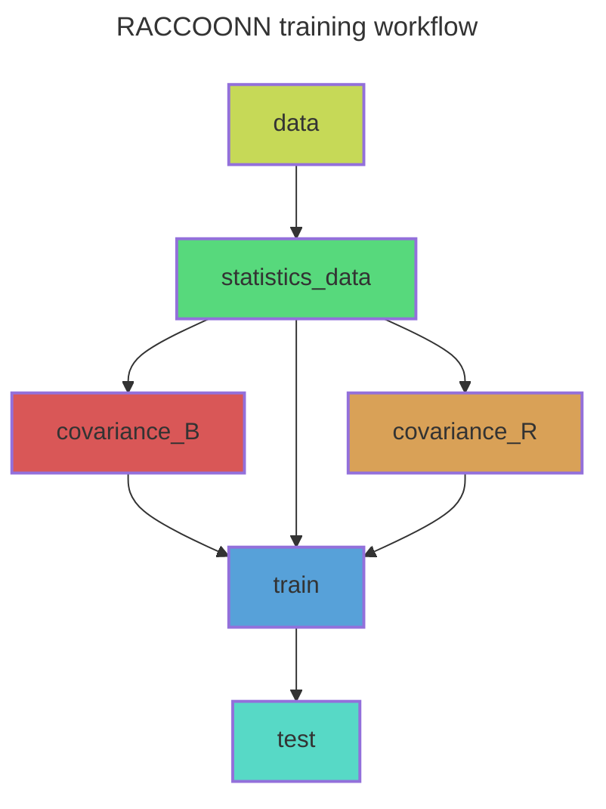

# RACCOONN: Retrieval of Atmospheric Conditions Computed using Observations, Optimization, and Neural Networks. 
RACCOONN leverages deep learning to retrieve thermodynamic profiles of the atmosphere from raw radiance observations, with or without knowledge of the prior state. In other words, this project aims to generate a 
deep learning inverse observation operator that would enable the assimilation of additional radiances in the form of thermodynamic profiles.

# Installation

Clone the following repository:

```bash
git clone https://github.com/tremblaybenoit/RACCOONN.git
```
RACCOONN was developed in the PyTorch Lightning framework and uses Hydra for flexibility.

# Usage
To ensure reproducibility, RACCOONN relies heavily on the ["Snakemake workflow management system"](https://snakemake.readthedocs.io/en/stable/). 
To perform a dry-run (i.e., to test the workflow prior to execution): 

```bash
snakemake -np 
```

To execute the workflow using a specified number of cores (e.g., 1):

```bash
snakemake --cores 1 
```

To draw a directed acyclic graph (DAG) of the training workflow (e.g., dag.mmd of rule "test""):

```bash
snakemake test --rulegraph mermaid-js --config hydra-experiment=pinnverse_operator_000 > dag.mmd
```
Replace "--rulegraph" with "--dag" to draw dashed bounding boxes around the completed steps.

The graph of the RACCOONN workflow is the following (for the pinnverse_operators experiment): 




# Documentation
The RACCOON project documentation is available at https://raccoonn.readthedocs.io/.

# References and Acknowledgements
- The forward model was translated from Keras to Pytorch Lightning from the following paper and repository: 
  - Paper by Howard et al. (2025): https://www.arxiv.org/abs/2504.16192.
  - Repository: https://zenodo.org/records/13963758.
- Inspiration for the PyTorch Lightning + Hydra framework comes from the following repositories: 
  - Lightning-Hydra-Template: https://github.com/ashleve/lightning-hydra-template.
  - Anemoi framework by ECMWF: https://github.com/ecmwf/anemoi-core.
- Inspiration for the use of Neural Fields (NFs) for retrievals/inversions comes from the following paper and repository:
  - Paper by Jarolim et al. (2025): https://arxiv.org/pdf/2502.13924.
  - Repository: https://github.com/RobertJaro/pinn-me.
- Inspiration for the use of emulation for retrievals/inversions comes from the following papers:
  - Paper by Girtsou et al. (2024): https://neurips.cc/media/PosterPDFs/NeurIPS%202024/100006.png?t=1733082861.1906157.
